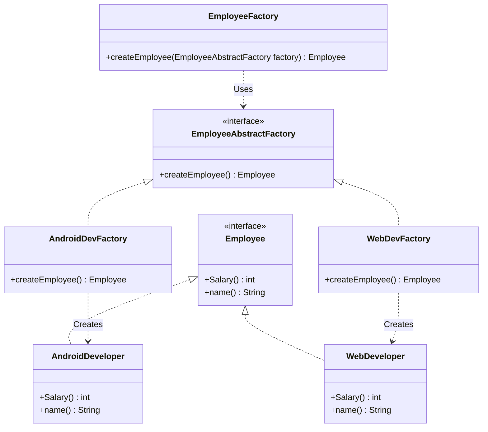

# Abstract Factory Pattern

The **Abstract Factory Pattern** is like a factory of factories. It lets you create families of related objects without specifying their exact classes.

---

## 💡 Concept
While a simple Factory Method creates just one product (like a single developer), the Abstract Factory creates a **group of related products**. 

For example, if you are making a user interface (UI), you might need a button and a checkbox. If the system runs on Windows, you want a Windows button and a Windows checkbox. If it runs on Mac, you want a Mac button and a Mac checkbox. You should not mix Mac buttons with Windows checkboxes.

---

## ❓ Why Do We Need This Pattern?
When you have to deal with multiple groups of related objects, creating them directly can cause problems:
1. **Mixing objects**: You might accidentally combine objects from different groups (like using a Windows button with a Mac checkbox). This can break the application.
2. **Messy code**: Your code will be full of `if-else` blocks to decide which object to create for which operating system or theme.
3. **Hard to update**: If you want to add support for a new operating system or theme (like Linux), you have to change your main code in many places.

The Abstract Factory pattern solves this by giving you a way to request a whole matching family of objects from a specific factory.

---

## 🛠️ Key Components
1. **Abstract Products**: Common layouts (interfaces) for the objects (for example, `Button` and `Checkbox`).
2. **Concrete Products**: The actual objects (for example, `WindowsButton`, `WindowsCheckbox`, `MacButton`, `MacCheckbox`).
3. **Abstract Factory**: The main interface that declares methods to create all the products in a family.
4. **Concrete Factories**: Factory classes that create objects for a specific family (for example, `WindowsFactory` makes Windows buttons and checkboxes).
5. **Client**: The code that uses these factories to get matching products.

---

## 📝 Example Structure



### Simple Code Example

```java
// 1. Common interfaces
public interface Button { void draw(); }
public interface Checkbox { void draw(); }

// 2. Windows Group
public class WindowsButton implements Button {
    public void draw() { System.out.println("Drawing Windows Button"); }
}
public class WindowsCheckbox implements Checkbox {
    public void draw() { System.out.println("Drawing Windows Checkbox"); }
}

// MacOS Group
public class MacButton implements Button {
    public void draw() { System.out.println("Drawing Mac Button"); }
}
public class MacCheckbox implements Checkbox {
    public void draw() { System.out.println("Drawing Mac Checkbox"); }
}

// 3. Abstract Factory
public interface GUIFactory {
    Button createButton();
    Checkbox createCheckbox();
}

// 4. Concrete Factories
public class WindowsFactory implements GUIFactory {
    public Button createButton() { return new WindowsButton(); }
    public Checkbox createCheckbox() { return new WindowsCheckbox(); }
}
public class MacFactory implements GUIFactory {
    public Button createButton() { return new MacButton(); }
    public Checkbox createCheckbox() { return new MacCheckbox(); }
}

// 5. Client
public class Application {
    private Button button;
    private Checkbox checkbox;

    public Application(GUIFactory factory) {
        // We do not care if it is Mac or Windows. The factory gives us matching parts.
        button = factory.createButton();
        checkbox = factory.createCheckbox();
    }

    public void draw() {
        button.draw();
        checkbox.draw();
    }
}
```

---

## ⚖️ Pros and Cons
### Pros:
- **No Mismatches**: You are guaranteed that the objects you get from a factory go well together.
- **Independent Client**: Your client code does not need to know about actual classes.
- **Easy to Add Families**: You can add a new theme or platform factory without changing the main client code.

### Cons:
- **Many Classes**: It requires writing a lot of interfaces and classes, which can be hard to manage.
- **Hard to Add New Products**: If you want to add a third component (like a textbox) to the families, you must update the Abstract Factory interface and all the factories.
