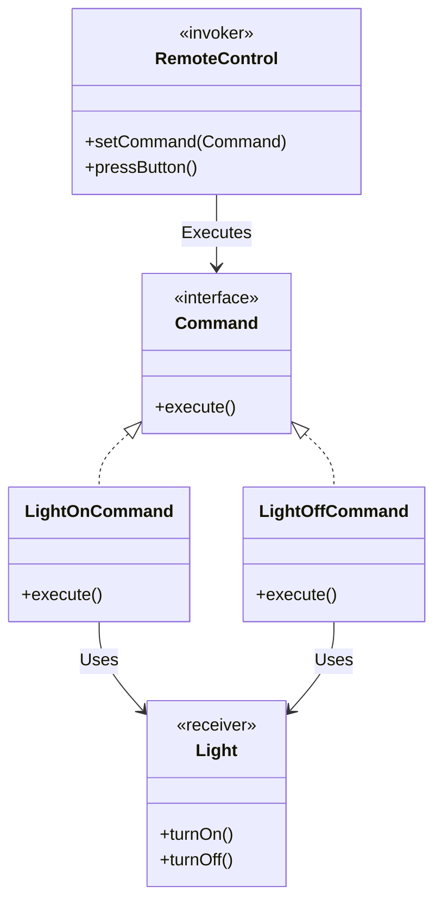

# Command Pattern

The **Command Pattern** turns a request or an action into a standalone object that contains all information about the request.

---

## 💡 Concept
Imagine a universal remote control. Pressing a button on the remote sends a command to a device (like a TV or AC). The button doesn't know *how* to turn on the TV; it just knows that pressing it will execute a specific command object. 

This pattern encapsulates a request as an object, allowing you to parameterize clients with queues, requests, or operations.

---

## ❓ Why Do We Need This Pattern?
1. **Decoupling**: The object that invokes the operation is decoupled from the object that knows how to perform it.
2. **Undo/Redo**: Since commands are objects, you can store their history and reverse them if needed.
3. **Queueing Operations**: Commands can be queued, delayed, or scheduled to run at a specific time.

---

## 🛠️ Key Components
1. **Command (Interface)**: Declares an execution method.
2. **Concrete Command**: Implements various kinds of requests. It delegates the actual work to a Receiver.
3. **Receiver**: Contains some business logic. Almost any object may act as a receiver.
4. **Invoker / Sender**: The class that triggers the command instead of sending the request directly to the receiver.
5. **Client**: Creates and configures concrete command objects.

---

## 📝 Example Structure



### Simple Code Example

```java
// 1. Command Interface
public interface Command {
    void execute();
}

// 2. Receiver
public class Light {
    public void turnOn() { System.out.println("Light is ON"); }
    public void turnOff() { System.out.println("Light is OFF"); }
}

// 3. Concrete Commands
public class LightOnCommand implements Command {
    private Light light;
    public LightOnCommand(Light light) { this.light = light; }
    public void execute() { light.turnOn(); }
}

public class LightOffCommand implements Command {
    private Light light;
    public LightOffCommand(Light light) { this.light = light; }
    public void execute() { light.turnOff(); }
}

// 4. Invoker
public class RemoteControl {
    private Command command;
    public void setCommand(Command command) { this.command = command; }
    public void pressButton() { command.execute(); }
}
```

---

## ⚖️ Pros and Cons
### Pros:
- **Single Responsibility Principle**: Decouples classes that invoke operations from classes that perform them.
- **Open/Closed Principle**: You can introduce new commands without breaking existing code.
- **Undo/Redo capabilities**: You can implement undo/redo and deferred execution.

### Cons:
- **Complexity**: The code may become more complicated since you're introducing a whole new layer between senders and receivers.
