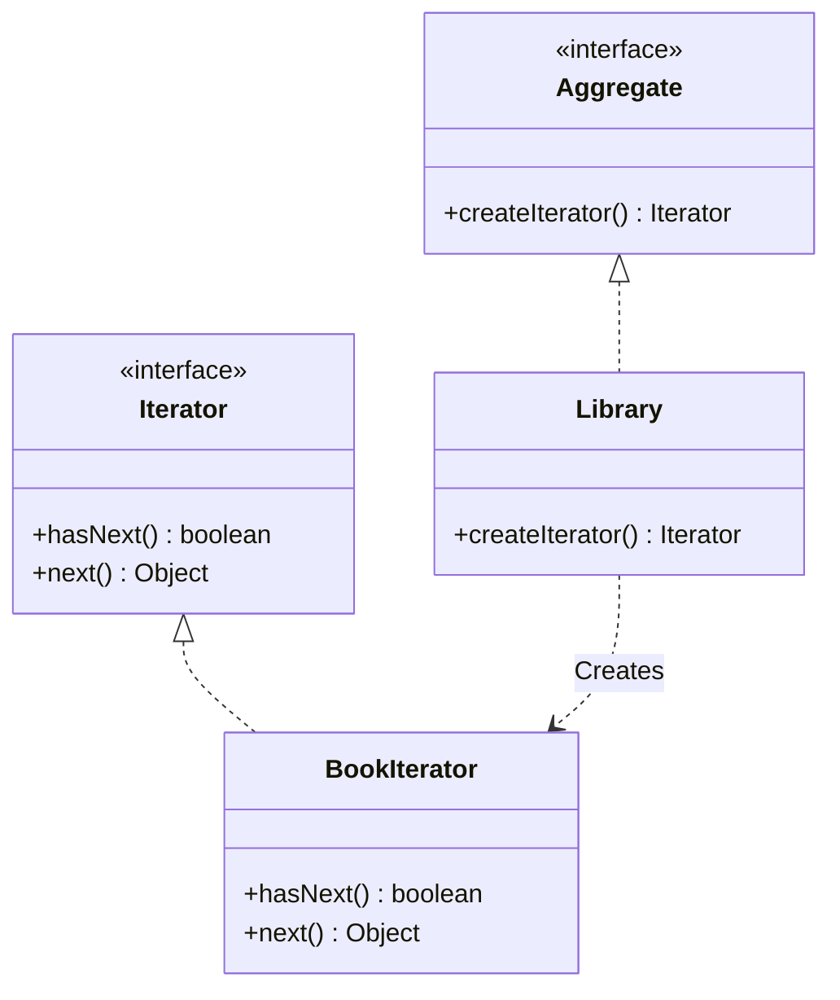

# Iterator Pattern

The **Iterator Pattern** provides a way to access the elements of a collection (like a list or a tree) sequentially without exposing its underlying representation.

---

## 💡 Concept
Usually, you might use a `for` loop to go through elements of a collection. But if the collection is a complex data structure (like a tree or a graph), iterating over it might require exposing its internal details.

With this pattern, you take the iteration logic out of the collection and put it in a separate **Iterator** object. This keeps the collection's code clean and standardizes how iteration works across different data structures.

---

## ❓ Why Do We Need This Pattern?
1. **Separation of concerns**: The collection class should only be responsible for storing data, not traversing it.
2. **Multiple traversals**: You can have multiple iterators traversing the same collection independently at the same time.
3. **Uniform interface**: It provides a standard way to iterate over different types of collections.

---

## 🛠️ Key Components
1. **Iterator (Interface)**: Declares operations for traversing a collection: fetching the next element, checking if there are more elements, etc.
2. **Concrete Iterator**: Implements the Iterator interface and keeps track of the current traversal position.
3. **Aggregate / IterableCollection (Interface)**: Declares a method for getting an iterator.
4. **Concrete Aggregate / Collection**: Returns a new instance of a particular concrete iterator.

---

## 📝 Example Structure



### Simple Code Example

```java
// 1. Iterator Interface
public interface Iterator {
    boolean hasNext();
    Object next();
}

// 2. Collection Interface
public interface Aggregate {
    Iterator createIterator();
}

// 3. Concrete Collection
public class Library implements Aggregate {
    private List<Book> books;
    
    public Library(List<Book> books) {
        this.books = books;
    }
    
    @Override
    public Iterator createIterator() {
        return new BookIterator(books);
    }
}

// 4. Concrete Iterator
public class BookIterator implements Iterator {
    private List<Book> books;
    private int position = 0;
    
    public BookIterator(List<Book> books) {
        this.books = books;
    }
    
    @Override
    public boolean hasNext() {
        return position < books.size();
    }
    
    @Override
    public Object next() {
        if (hasNext()) {
            return books.get(position++);
        }
        return null;
    }
}
```

---

## ⚖️ Pros and Cons
### Pros:
- **Clean Code**: Extracts bulky traversal algorithms into separate classes.
- **Single Responsibility Principle**: Collections manage data; iterators manage traversal.
- **Open/Closed Principle**: You can implement new types of collections and iterators without breaking existing code.

### Cons:
- **Overhead**: Applying it to very simple collections might be an overkill.
