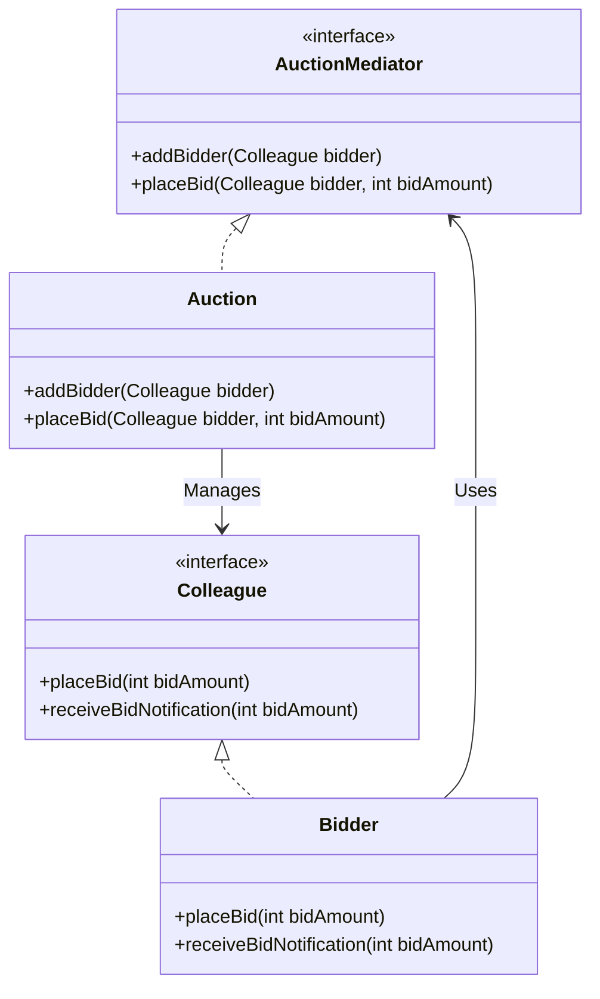

# Mediator Pattern

The **Mediator Pattern** restricts direct communications between objects and forces them to collaborate only via a mediator object.

---

## 💡 Concept
If you have a system with many objects that need to talk to each other, the connections between them can look like a tangled spiderweb. 

With the Mediator pattern, objects don't communicate directly. Instead, they send messages to a **Mediator**, which handles the routing and logic of who should receive what. Think of it like the control tower at an airport: planes do not talk directly to each other; they talk to the tower.

---

## ❓ Why Do We Need This Pattern?
1. **Reduces coupling**: Objects don't need to know about each other, they only need to know the mediator.
2. **Easier to maintain**: Centralizes complex communication logic in one place.
3. **Reusable components**: Because components are not tightly coupled to other components, they are easier to reuse in other programs.

---

## 🛠️ Key Components
1. **Mediator (Interface)**: Declares methods for communication with components.
2. **Concrete Mediator**: Encapsulates relations between various components. Keeps references to all components and manages their communication.
3. **Colleague / Component**: The classes that contain business logic. They know the mediator but do not know other colleagues.

---

## 📝 Example Structure



### Simple Code Example

```java
// 1. Mediator Interface
public interface AuctionMediator {
    void addBidder(Colleague bidder);
    void placeBid(Colleague bidder, int bidAmount);
}

// 2. Colleague Interface
public interface Colleague {
    void placeBid(int bidAmount);
    void receiveBidNotification(int bidAmount);
    String getName();
}

// 3. Concrete Mediator
public class Auction implements AuctionMediator {
    private List<Colleague> bidders = new ArrayList<>();
    
    @Override
    public void addBidder(Colleague bidder) {
        bidders.add(bidder);
    }
    
    @Override
    public void placeBid(Colleague bidder, int bidAmount) {
        for (Colleague b : bidders) {
            if (b != bidder) {
                b.receiveBidNotification(bidAmount);
            }
        }
    }
}

// 4. Concrete Colleague
public class Bidder implements Colleague {
    private String name;
    private AuctionMediator mediator;
    
    public Bidder(String name, AuctionMediator mediator) {
        this.name = name;
        this.mediator = mediator;
    }
    
    @Override
    public void placeBid(int bidAmount) {
        System.out.println(name + " placed bid: " + bidAmount);
        mediator.placeBid(this, bidAmount);
    }
    
    @Override
    public void receiveBidNotification(int bidAmount) {
        System.out.println(name + " received notification of new bid: " + bidAmount);
    }
    
    @Override
    public String getName() {
        return name;
    }
}
```

---

## ⚖️ Pros and Cons
### Pros:
- **Decoupling**: Reduces tight coupling between different components.
- **Centralized Control**: Makes it easier to understand how components interact by looking at the mediator.
- **Simplifies Object Protocols**: Replaces many-to-many relationships with one-to-many.

### Cons:
- **God Object Risk**: Over time, a mediator can become a "God Object" (a class that knows too much or does too much) if not maintained carefully.
