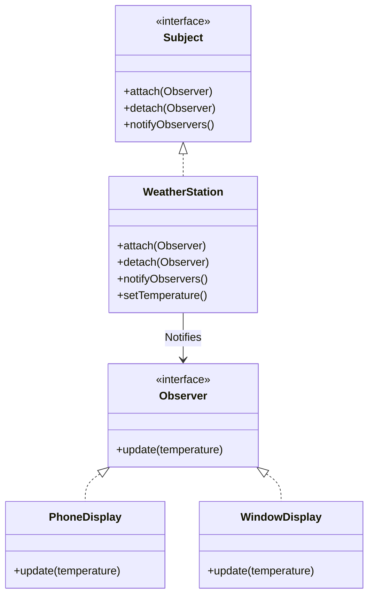

# Observer Pattern

The **Observer Pattern** defines a one-to-many dependency between objects so that when one object changes state, all its dependents are notified and updated automatically.

---

## 💡 Concept
Think of a YouTube channel subscription. You don't have to check the channel every hour to see if there's a new video. Instead, you subscribe to it, and YouTube sends you a notification when a new video is published.

In this pattern, the "Channel" is the **Subject** and the "Subscribers" are the **Observers**.

---

## ❓ Why Do We Need This Pattern?
1. **Dynamic relationships**: Allows you to establish relationships between objects at runtime.
2. **Decoupling**: The subject doesn't need to know the details of its observers, only that they implement a specific interface.
3. **Event handling**: Excellent for creating event-driven systems where one component reacts to changes in another.

---

## 🛠️ Key Components
1. **Subject / Publisher**: Maintains a list of observers and notifies them of state changes.
2. **Observer / Subscriber (Interface)**: Declares the update method used by the subject to notify them.
3. **Concrete Subject**: Stores the state of interest to concrete observers and sends a notification when its state changes.
4. **Concrete Observer**: Maintains a reference to a concrete subject, stores state that should stay consistent with the subject's, and implements the update method.

---

## 📝 Example Structure



### Simple Code Example

```java
// 1. Observer Interface
public interface Observer {
    void update(int temperature);
}

// 2. Subject Interface
public interface Subject {
    void attach(Observer o);
    void detach(Observer o);
    void notifyObservers();
}

// 3. Concrete Subject
public class WeatherStation implements Subject {
    private List<Observer> observers = new ArrayList<>();
    private int temperature;

    public void setTemperature(int temp) {
        this.temperature = temp;
        notifyObservers();
    }

    public void attach(Observer o) { observers.add(o); }
    public void detach(Observer o) { observers.remove(o); }
    public void notifyObservers() {
        for (Observer o : observers) {
            o.update(temperature);
        }
    }
}

// 4. Concrete Observers
public class PhoneDisplay implements Observer {
    public void update(int temperature) {
        System.out.println("Phone Display: Temperature is " + temperature);
    }
}
```

---

## ⚖️ Pros and Cons
### Pros:
- **Open/Closed Principle**: You can introduce new subscriber classes without changing the publisher's code.
- **Loose Coupling**: Subjects and observers can interact without knowing much about each other.

### Cons:
- **Unexpected Updates**: Observers are notified in random order, and one change might trigger a cascade of updates if observers modify the subject back.
