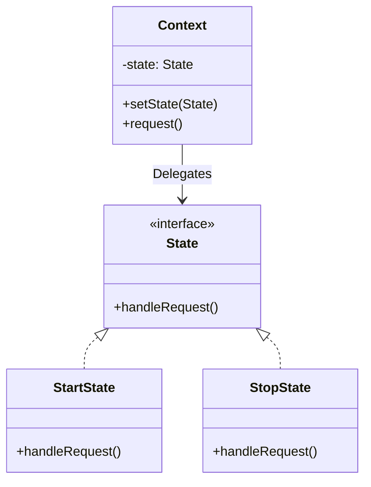

# State Pattern

The **State Pattern** allows an object to alter its behavior when its internal state changes. It appears as if the object changed its class.

---

## 💡 Concept
Imagine a smartphone. When it's unlocked, pressing buttons executes apps. When it's locked, pressing buttons does nothing except wake up the screen. The phone changes its behavior based on its internal "state" (Locked or Unlocked).

Instead of using many `if` or `switch` statements to check the state before performing an action, this pattern extracts the state-specific behavior into separate classes.

---

## ❓ Why Do We Need This Pattern?
1. **Eliminate giant switch statements**: Simplifies code by replacing large conditionals with polymorphism.
2. **Organize code**: Groups behavior related to particular states into specific classes.
3. **Easy state transitions**: Makes state transitions explicit rather than relying on assigning values to variables.

---

## 🛠️ Key Components
1. **Context**: Maintains an instance of a ConcreteState subclass that defines the current state.
2. **State (Interface)**: Defines the interface for encapsulating the behavior associated with a particular state of the Context.
3. **Concrete States**: Each subclass implements a behavior associated with a state of the Context.

---

## 📝 Example Structure



### Simple Code Example

```java
// 1. State Interface
public interface State {
    void doAction(Context context);
}

// 2. Concrete States
public class StartState implements State {
    public void doAction(Context context) {
        System.out.println("Player is in start state");
        context.setState(this);
    }
    public String toString() { return "Start State"; }
}

public class StopState implements State {
    public void doAction(Context context) {
        System.out.println("Player is in stop state");
        context.setState(this);
    }
    public String toString() { return "Stop State"; }
}

// 3. Context
public class Context {
    private State state;

    public Context() { state = null; }
    
    public void setState(State state) { this.state = state; }
    public State getState() { return state; }
}

// 4. Usage
public class Client {
    public static void main(String[] args) {
        Context context = new Context();

        State startState = new StartState();
        startState.doAction(context);

        State stopState = new StopState();
        stopState.doAction(context);
    }
}
```

---

## ⚖️ Pros and Cons
### Pros:
- **Single Responsibility Principle**: Organizes code related to particular states into separate classes.
- **Open/Closed Principle**: Introduce new states without changing existing state classes or the context.
- **Simplifies Context**: Removes bulky state machine conditionals from the Context.

### Cons:
- **Overkill**: Can be an overkill if a state machine has only a few states or rarely changes.
