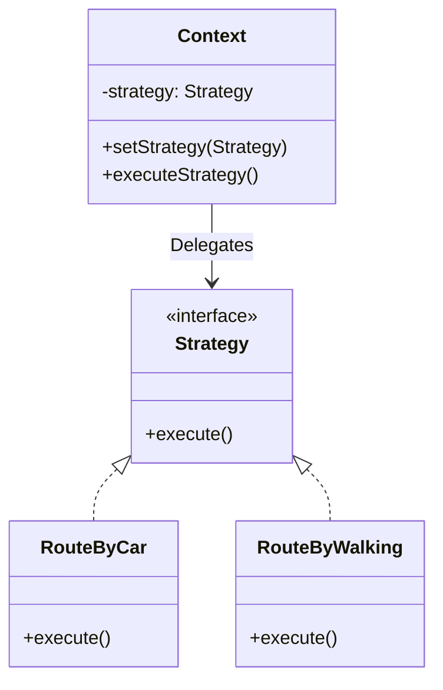

# Strategy Pattern

The **Strategy Pattern** lets you define a family of algorithms, put each of them into a separate class, and make their objects interchangeable.

---

## 💡 Concept
Imagine you are building an app that calculates the best route for a user. Initially, it only calculates routes for cars. Later, you add walking routes. Then, public transport. 

Instead of cramming all routing algorithms into one giant class with massive conditionals, the Strategy pattern suggests taking these algorithms out into separate classes called *strategies*. The main class (Context) simply delegates the execution to the currently selected strategy.

---

## ❓ Why Do We Need This Pattern?
1. **Interchangeable algorithms**: Allows switching the algorithm or logic at runtime.
2. **Isolate business logic**: Separates the algorithms from the code that uses them.
3. **Avoids conditionals**: Replaces massive `if-else` or `switch` statements with polymorphism.

---

## 🛠️ Key Components
1. **Strategy (Interface)**: Common interface for all supported algorithms.
2. **Concrete Strategies**: Implement different variations of an algorithm the context uses.
3. **Context**: Maintains a reference to a Strategy object and communicates with it via the Strategy interface.

---

## 📝 Example Structure



### Simple Code Example

```java
// 1. Strategy Interface
public interface RouteStrategy {
    void buildRoute(String start, String end);
}

// 2. Concrete Strategies
public class DriveStrategy implements RouteStrategy {
    public void buildRoute(String start, String end) {
        System.out.println("Building driving route from " + start + " to " + end);
    }
}

public class WalkStrategy implements RouteStrategy {
    public void buildRoute(String start, String end) {
        System.out.println("Building walking route from " + start + " to " + end);
    }
}

// 3. Context
public class Navigator {
    private RouteStrategy strategy;
    
    public void setStrategy(RouteStrategy strategy) {
        this.strategy = strategy;
    }
    
    public void navigate(String start, String end) {
        strategy.buildRoute(start, end);
    }
}

// 4. Usage
public class Client {
    public static void main(String[] args) {
        Navigator navigator = new Navigator();
        
        // Use Driving Strategy
        navigator.setStrategy(new DriveStrategy());
        navigator.navigate("Home", "Office");
        
        // Switch to Walking Strategy
        navigator.setStrategy(new WalkStrategy());
        navigator.navigate("Park", "Cafe");
    }
}
```

---

## ⚖️ Pros and Cons
### Pros:
- **Runtime switching**: You can swap algorithms used inside an object at runtime.
- **Isolation**: Isolates the implementation details of an algorithm from the code that uses it.
- **Open/Closed Principle**: You can introduce new strategies without modifying the context.

### Cons:
- **Client awareness**: Clients must be aware of the differences between strategies to select the right one.
- **More classes**: Increases the number of objects and classes in your application.
