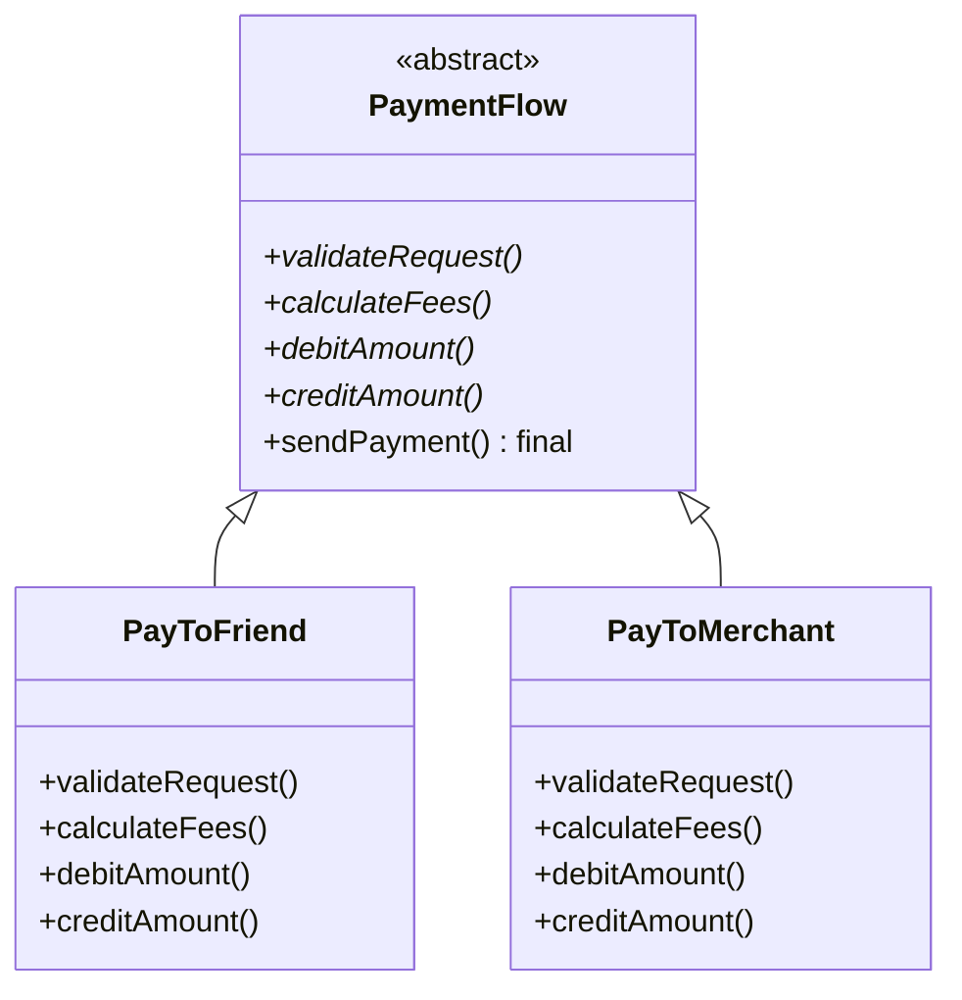

# Template Method Pattern

The **Template Method Pattern** is a behavioral design pattern that defines the skeleton of an algorithm in the superclass but lets subclasses override specific steps of the algorithm without changing its overall structure.

---

## 💡 Concept
Imagine you are building different types of houses (a wooden house, a glass house, etc.). The process of building any house has the same basic steps: build the foundation, build the walls, add a roof. 

The Template Method suggests that you define these steps in a base class using a "template method". The overall sequence remains fixed (you can't add a roof before the foundation), but subclasses can provide their own specific materials for walls or roof.

---

## ❓ Why Do We Need This Pattern?
1. **Code Reusability**: Prevents code duplication by pulling common algorithms into a single base class.
2. **Enforces Structure**: Ensures that the overall algorithm's structure is preserved while allowing subclasses to modify individual steps.
3. **Inversion of Control**: The parent class calls the operations of a subclass, not the other way around ("Don't call us, we'll call you" — also known as the Hollywood Principle).

---

## 🛠️ Key Components
1. **Abstract Class**: Defines the abstract steps, as well as the actual template method which calls these steps in a specific order. The template method is usually marked `final` so it can't be overridden.
2. **Concrete Classes**: Subclasses that implement or override the abstract steps to provide their own specific logic.

---

## 📝 Example Structure



### Simple Code Example

```java
// 1. Abstract Class defining the Template Method
public abstract class PaymentFlow {
    
    // The individual steps
    public abstract void validateRequest();
    public abstract void calculateFees();
    public abstract void debitAmount();
    public abstract void creditAmount();

    // The Template Method (marked final so subclasses cannot change the sequence)
    public final void sendPayment() {
        validateRequest();
        calculateFees();
        debitAmount();
        creditAmount();
    }
}

// 2. Concrete Class 1
public class PayToFriend extends PaymentFlow {
    @Override
    public void validateRequest() {
        System.out.println("Validate logic of PayToFriend");
    }

    @Override
    public void calculateFees() {
        System.out.println("Calculate Fees of PayToFriend - (Usually 0%)");
    }

    @Override
    public void debitAmount() {
        System.out.println("Debit the amount logic of PayToFriend");
    }

    @Override
    public void creditAmount() {
        System.out.println("Credit the amount logic of PayToFriend");
    }
}

// 3. Concrete Class 2
public class PayToMerchant extends PaymentFlow {
    @Override
    public void validateRequest() {
        System.out.println("Validate logic of PayToMerchant");
    }

    @Override
    public void calculateFees() {
        System.out.println("Calculate Fees of PayToMerchant - (e.g. 2%)");
    }

    @Override
    public void debitAmount() {
        System.out.println("Debit the amount logic of PayToMerchant");
    }

    @Override
    public void creditAmount() {
        System.out.println("Credit the amount logic of PayToMerchant");
    }
}

// 4. Client Usage
public class Main {
    public static void main(String[] args) {
        System.out.println("--- Friend Payment ---");
        PaymentFlow friendPayment = new PayToFriend();
        friendPayment.sendPayment();

        System.out.println("\n--- Merchant Payment ---");
        PaymentFlow merchantPayment = new PayToMerchant();
        merchantPayment.sendPayment();
    }
}
```

---

## ⚖️ Pros and Cons
### Pros:
- **Removes code duplication**: Shared logic is kept in the superclass.
- **Controlled customization**: You can let clients override only certain parts of a large algorithm, making them less affected by changes to other parts.

### Cons:
- **Rigidity**: Some clients may be limited by the provided skeleton of an algorithm.
- **Maintenance**: Template methods tend to be harder to maintain the more steps they have.
