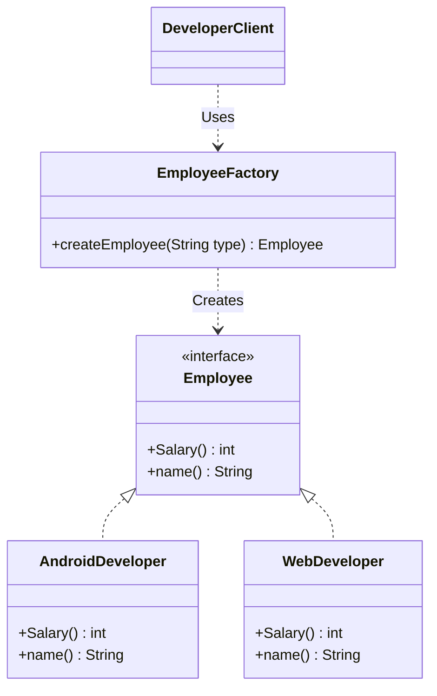

# Factory Method Pattern

The **Factory Method Pattern** is a way to create objects without using the `new` keyword directly in your main code. Instead, you use a special method (the "Factory Method") to create the objects for you.

---

## 💡 Concept
Usually, when you want to create an object, you write `new AndroidDeveloper()`. This links your main code directly to that class. 

With this pattern, you do not create the object yourself. You ask a Factory class to make it for you. This keeps your classes separate and independent.

---

## ❓ Why Do We Need This Pattern?
If you create objects using the `new` keyword everywhere in your code:
1. **Hard to change**: If you decide to use a different class or add a new developer type, you have to find and change the code in many places.
2. **Messy code**: The logic to decide which object to create is spread out everywhere.
3. **Hard to test**: It is difficult to test classes that are directly linked to other classes.

The Factory Method pattern solves this by putting the object creation code in one single place (the Factory class).

---

## 🛠️ Key Components
1. **Product (Interface)**: The common layout for all objects (for example, `Employee`).
2. **Concrete Products (Classes)**: The actual objects you want to create (for example, `AndroidDeveloper` and `WebDeveloper`).
3. **Factory (Class)**: The class that has the method to create and return the objects.
4. **Client**: The code that asks the Factory for an object and uses it.

---

## 📝 Example Structure



### Simple Code Example

```java
// 1. Common interface
public interface Employee {
    int getSalary();
    String getRole();
}

// 2. First actual class
public class AndroidDeveloper implements Employee {
    @Override
    public int getSalary() { return 60000; }
    
    @Override
    public String getRole() { return "Android Developer"; }
}

// 3. Second actual class
public class WebDeveloper implements Employee {
    @Override
    public int getSalary() { return 50000; }
    
    @Override
    public String getRole() { return "Web Developer"; }
}

// 4. The Factory class
public class EmployeeFactory {
    public static Employee createEmployee(String type) {
        if ("Android Developer".equalsIgnoreCase(type)) {
            return new AndroidDeveloper();
        } else if ("Web Developer".equalsIgnoreCase(type)) {
            return new WebDeveloper();
        }
        return null;
    }
}

// 5. How to use it
public class Client {
    public static void main(String[] args) {
        Employee emp = EmployeeFactory.createEmployee("Android Developer");
        System.out.println("Role: " + emp.getRole() + ", Salary: " + emp.getSalary());
    }
}
```

---

## ⚖️ Pros and Cons
### Pros:
- **Separation**: Your main code does not need to know about the actual classes.
- **One Place for Edits**: All object creation code is in one place. If you add a new type, you only update the factory.
- **Easy to Add**: You can add new developer types without breaking existing code.

### Cons:
- **More Classes**: You have to write more files and classes, which can make the project look complex.
