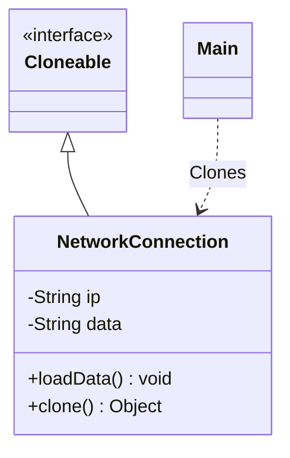

# Prototype Design Pattern

The **Prototype Pattern** is a creational design pattern that lets you copy (clone) existing objects instead of creating new ones from scratch.

---

## 💡 Concept
If creating a new object is very slow or takes a lot of computer resources (for example, it has to download data from a database or run a heavy calculation), it is much faster to copy a pre-made object that already has the data.

In Java, we do this by implementing the `Cloneable` interface and overriding the `clone()` method.

---

## ❓ Why Do We Need This Pattern?
Creating objects from scratch using the `new` keyword has some limits:
1. **Slow performance**: If creating an object requires slow operations like loading files or hitting a network, doing this repeatedly makes your code slow.
2. **Hidden classes**: Sometimes you get an object via an interface, and you do not know its exact concrete class. Without knowing the class, you cannot call `new ClassName()`.
3. **Complex states**: If you have configured an object's properties in a very specific way, creating a new object and setting all those values manually again is tedious and easy to get wrong.

The Prototype pattern solves this by letting the object copy itself.

---

## ⚠️ Shallow Copy vs. Deep Copy
When you copy an object, there are two ways to do it:
- **Shallow Copy**: Copies the basic values. If the object contains other objects (like a list), it copies only the reference (the link). The original object and the new copy will share the same nested objects. This is Java's default behavior.
- **Deep Copy**: Copies everything. It creates a brand-new copy of the nested objects as well. The copy is 100% independent of the original.

---

## 🛠️ Key Components
1. **Prototype (Interface)**: The interface that declares the method for copying itself (like Java's `Cloneable`).
2. **Concrete Prototype**: The actual class that implements the copy logic.
3. **Client**: The code that asks the object to copy itself.

---

## 📝 Example Structure



### Simple Code Example

```java
// Implement Cloneable to tell Java this class can be copied
public class NetworkConnection implements Cloneable {
    private String ip;
    private String data;

    public NetworkConnection() {}

    public void setIp(String ip) { this.ip = ip; }
    public String getIp() { return ip; }

    public void loadData() {
        // Simulating a very slow network load
        this.data = "Downloaded data from network";
    }

    @Override
    protected Object clone() throws CloneNotSupportedException {
        // Performs default shallow copy
        return super.clone();
    }

    @Override
    public String toString() {
        return "NetworkConnection{ip='" + ip + "', data='" + data + "'}";
    }
}

// Client code
public class Main {
    public static void main(String[] args) throws CloneNotSupportedException {
        NetworkConnection original = new NetworkConnection();
        original.setIp("192.168.1.1");
        original.loadData(); // Slow operation

        // Copy the original object instead of calling new and loading data again
        NetworkConnection copy = (NetworkConnection) original.clone();
        copy.setIp("192.168.1.2"); // Change only what you need to change

        System.out.println("Original: " + original);
        System.out.println("Copy: " + copy);
    }
}
```

---

## ⚖️ Pros and Cons
### Pros:
- **Fast**: Cloning objects is much faster than recreating them and doing heavy initialization.
- **Easy Copying**: You can copy complex objects easily.
- **Independence**: You can clone objects without depending on their concrete classes.

### Cons:
- **Complex Deep Copy**: If an object references many other objects (especially in loops), writing the code to deep-copy everything can be very hard and error-prone.
