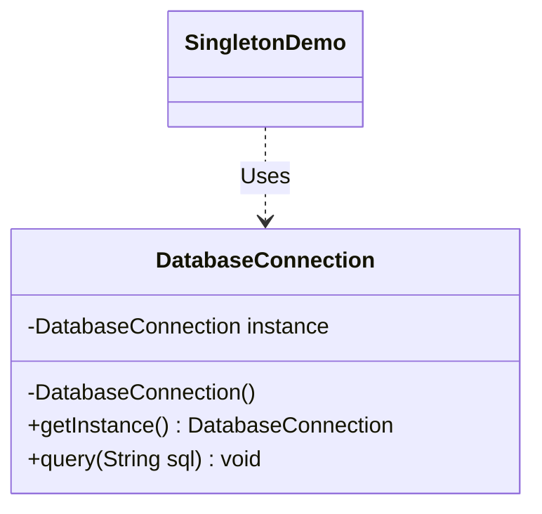

# Singleton Design Pattern

The **Singleton Pattern** is a creational design pattern that makes sure a class has only one instance, and provides a global way to access it.

---

## 💡 Concept
Sometimes, you want to have exactly one instance of a class. For example, if you have a database connection or a logger tool, you do not want to create a new connection every time. You want to share one single connection across the whole application.

---

## ❓ Why Do We Need This Pattern?
If you let anyone create objects using the `new` keyword:
1. **Wasted resources**: Creating multiple database connections or file writers consumes a lot of memory and slows down the system.
2. **Conflicting actions**: If two different parts of the code try to write to the same log file at the same time by creating new file writers, they can overwrite or corrupt each other's data.
3. **Hard to share state**: Sharing global settings or configurations across different screens or modules becomes very hard if everyone is creating their own settings object.

The Singleton pattern solves this by ensuring only one object can ever be created, and everyone uses that same object.

---

## 🛠️ Key Steps to Make a Singleton
To make a class a Singleton, follow these three simple steps:
1. **Private Constructor**: Make the constructor private so that no one can write `new MyClass()` from outside.
2. **Private Static Field**: Store the single instance in a private static variable inside the class.
3. **Public Static Method**: Provide a public static method (often called `getInstance()`) that returns the single instance. If the instance does not exist yet, this method creates it; otherwise, it returns the existing one.

---

## 📝 Example Structure



### Simple Code Example

```java
public class DatabaseConnection {
    // 1. Store the only instance here
    private static DatabaseConnection instance;

    // 2. Private constructor so no one can use 'new'
    private DatabaseConnection() {
        System.out.println("Connected to Database!");
    }

    // 3. Public method to get the instance
    public static DatabaseConnection getInstance() {
        if (instance == null) {
            // Use synchronized to make it safe for multiple threads
            synchronized (DatabaseConnection.class) {
                if (instance == null) {
                    instance = new DatabaseConnection(); // Created only once
                }
            }
        }
        return instance;
    }

    public void query(String sql) {
        System.out.println("Running query: " + sql);
    }
}
```

---

## ⚖️ Pros and Cons
### Pros:
- **Saves Resources**: You do not waste memory creating duplicate objects.
- **Controlled Access**: You control exactly when and how the object is accessed.
- **Only One Instance**: You are guaranteed that there is only one instance in the entire system.

### Cons:
- **Hard to Test**: Since it acts like a global state, it is difficult to isolate and test different parts of the program.
- **Multithreading**: You must write extra thread-safe code (like synchronized blocks) to prevent two threads from creating two instances at the same time.
