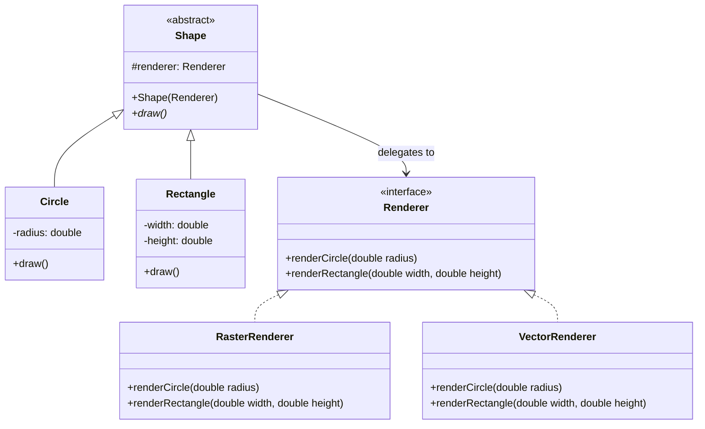

# Bridge Pattern

The **Bridge Pattern** is a structural design pattern that lets you split a large class or a set of closely related classes into two separate hierarchies — **abstraction** and **implementation** — which can be developed independently of each other.

---

## 💡 Concept
Imagine you want to draw shapes (Circle, Rectangle) using different rendering engines (Raster, Vector). Without the Bridge pattern, you'd need a class for every combination: `RasterCircle`, `VectorCircle`, `RasterRectangle`, `VectorRectangle`. Adding one new shape or renderer would double the number of classes.

The Bridge pattern solves this by separating the **Shape** (abstraction) from the **Renderer** (implementation). The shape holds a reference to a renderer and delegates the actual drawing work to it. Now you can add new shapes or new renderers independently without an explosion of subclasses.

---

## ❓ Why Do We Need This Pattern?
1. **Avoids Class Explosion**: Instead of creating N × M subclasses (N shapes × M renderers), you only need N + M classes.
2. **Independent Development**: The abstraction hierarchy and the implementation hierarchy can evolve independently.
3. **Runtime Switching**: You can change the implementation used by an abstraction at runtime (e.g., switch from Raster to Vector rendering on the fly).

---

## 🛠️ Key Components
1. **Abstraction**: Defines the high-level control layer (e.g., `Shape`). It holds a reference to the Implementation.
2. **Refined Abstraction**: Extends the Abstraction with more specific details (e.g., `Circle`, `Rectangle`).
3. **Implementation (Interface)**: Defines the interface for all implementation classes (e.g., `Renderer`).
4. **Concrete Implementation**: Provides a specific implementation of the interface (e.g., `RasterRenderer`, `VectorRenderer`).

---

## 📝 Example Structure



### Simple Code Example

```java
// 1. Implementation Interface
public interface Renderer {
    void renderCircle(double radius);
    void renderRectangle(double width, double height);
}

// 2. Concrete Implementations
public class RasterRenderer implements Renderer {
    @Override
    public void renderCircle(double radius) {
        System.out.println("Raster Rendering: Drawing Circle with radius " + radius);
    }
    @Override
    public void renderRectangle(double width, double height) {
        System.out.println("Raster Rendering: Drawing Rectangle " + width + "x" + height);
    }
}

public class VectorRenderer implements Renderer {
    @Override
    public void renderCircle(double radius) {
        System.out.println("Vector Rendering: Drawing Circle with radius " + radius);
    }
    @Override
    public void renderRectangle(double width, double height) {
        System.out.println("Vector Rendering: Drawing Rectangle " + width + "x" + height);
    }
}

// 3. Abstraction
public abstract class Shape {
    protected Renderer renderer;
    public Shape(Renderer renderer) {
        this.renderer = renderer;
    }
    public abstract void draw();
}

// 4. Refined Abstractions
public class Circle extends Shape {
    private double radius;
    public Circle(Renderer renderer, double radius) {
        super(renderer);
        this.radius = radius;
    }
    @Override
    public void draw() {
        renderer.renderCircle(radius);
    }
}

public class Rectangle extends Shape {
    private double width, height;
    public Rectangle(Renderer renderer, double width, double height) {
        super(renderer);
        this.width = width;
        this.height = height;
    }
    @Override
    public void draw() {
        renderer.renderRectangle(width, height);
    }
}

// 5. Client Usage
public class Main {
    public static void main(String[] args) {
        Renderer raster = new RasterRenderer();
        Renderer vector = new VectorRenderer();

        Shape rasterCircle = new Circle(raster, 5);
        Shape vectorCircle = new Circle(vector, 5);

        rasterCircle.draw();  // Raster Rendering: Drawing Circle with radius 5
        vectorCircle.draw();  // Vector Rendering: Drawing Circle with radius 5
    }
}
```

### 🔑 How It Works (Step by Step)
1. Define a `Renderer` interface with methods for each shape rendering.
2. Create concrete renderers (`RasterRenderer`, `VectorRenderer`) that implement the rendering.
3. Create an abstract `Shape` class that holds a `Renderer` reference (the "bridge").
4. Each concrete shape (`Circle`, `Rectangle`) delegates its `draw()` call to the renderer.
5. The client picks a renderer and passes it to a shape — the two hierarchies are completely independent.

---

## ⚖️ Pros and Cons
### Pros:
- **Platform Independence**: You can create platform-independent classes and apps by separating abstraction from implementation.
- **Open/Closed Principle**: You can introduce new abstractions and implementations independently of each other.
- **Single Responsibility Principle**: The abstraction focuses on high-level logic, and the implementation handles platform details.

### Cons:
- **Increased Complexity**: Applying the pattern to a highly cohesive class that doesn't naturally separate may overcomplicate the code.
- **Indirection**: More levels of indirection can make the code harder to follow.
