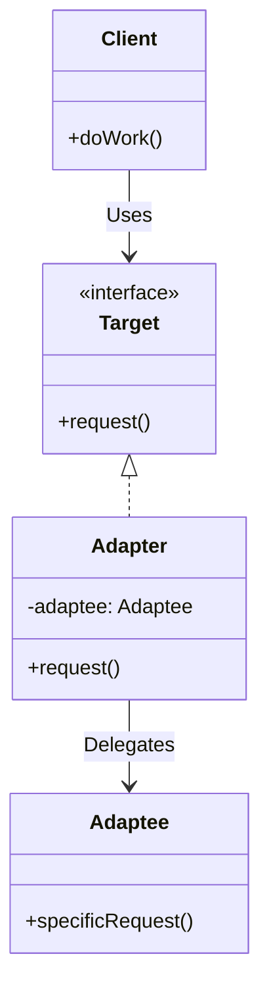

# Adapter Pattern

The **Adapter Pattern** is a structural design pattern that allows objects with incompatible interfaces to collaborate.

---

## 💡 Concept
Imagine you are traveling from the US to Europe. Your laptop has a US-style power plug, but the wall sockets in Europe are different. You can't plug your laptop directly into the wall. What do you do? You use a power adapter.

In software engineering, an adapter acts as a bridge between two incompatible interfaces, wrapping an otherwise incompatible object in an adapter to make it compatible with another class.

---

## ❓ Why Do We Need This Pattern?
1. **Reusability**: You can reuse existing classes even if their interfaces don't match the one you need.
2. **Third-party libraries**: Often used when integrating third-party libraries or legacy code into your application without altering their original code.
3. **Decoupling**: Separates the interface translation logic from the primary business logic.

---

## 🛠️ Key Components
1. **Target (Interface)**: Defines the domain-specific interface that the client uses.
2. **Client**: Collaborates with objects conforming to the Target interface.
3. **Adaptee**: The existing class with an incompatible interface that needs adapting.
4. **Adapter**: Adapts the interface of Adaptee to the Target interface.

---

## 📝 Example Structure



### Simple Code Example

```java
// 1. Target Interface
public interface WebDriver {
    void getElement();
    void selectElement();
}

// 2. Adaptee (Third-party or legacy class)
public class IEDriver {
    public void findElement() {
        System.out.println("Find element from IE Driver");
    }
    public void clickElement() {
        System.out.println("Click element from IE Driver");
    }
}

// 3. Adapter
public class WebDriverAdapter implements WebDriver {
    private IEDriver ieDriver;
    
    public WebDriverAdapter(IEDriver ieDriver) {
        this.ieDriver = ieDriver;
    }
    
    @Override
    public void getElement() {
        ieDriver.findElement();
    }
    
    @Override
    public void selectElement() {
        ieDriver.clickElement();
    }
}

// 4. Client
public class Client {
    public static void main(String[] args) {
        IEDriver ieDriver = new IEDriver();
        WebDriver webDriver = new WebDriverAdapter(ieDriver);
        
        webDriver.getElement();
        webDriver.selectElement();
    }
}
```

---

## ⚖️ Pros and Cons
### Pros:
- **Single Responsibility Principle**: Separates the interface or data conversion code from the primary business logic.
- **Open/Closed Principle**: You can introduce new types of adapters into the program without breaking the existing client code.

### Cons:
- **Complexity**: Sometimes it's simpler just to change the service class so that it matches the rest of your code, rather than introducing adapters.
