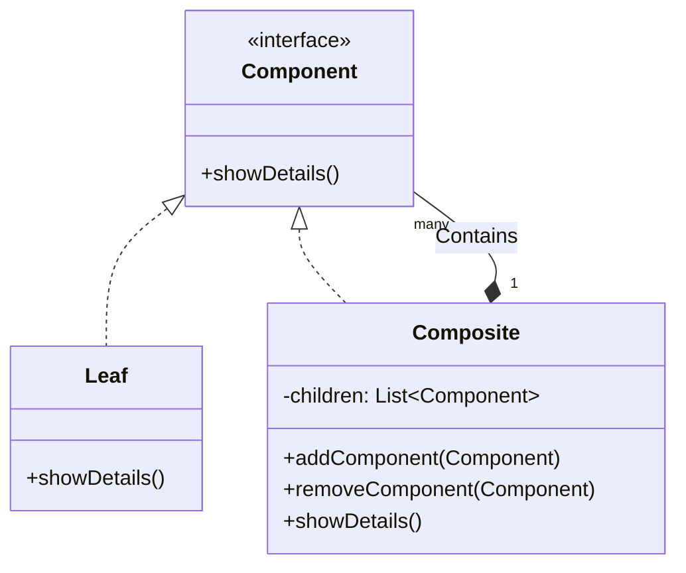

# Composite Pattern

The **Composite Pattern** is a structural design pattern that lets you compose objects into tree structures and then work with these structures as if they were individual objects.

---

## 💡 Concept
Imagine a company hierarchy. You have an organization composed of departments, which are in turn composed of teams, which contain individual employees. If you want to calculate the total salary of the organization, you have to iterate through every department, team, and employee.

The Composite pattern simplifies this by providing a unified interface (like `getSalary()`) for both simple elements (employees) and complex elements (departments). You simply call the method on the top-level element, and it delegates the call down the tree.

---

## ❓ Why Do We Need This Pattern?
1. **Tree Structures**: Essential when representing part-whole hierarchies.
2. **Uniformity**: Allows clients to treat individual objects and compositions of objects uniformly.
3. **Simplicity**: The client code doesn't need to check whether it's dealing with a leaf or a composite object.

---

## 🛠️ Key Components
1. **Component (Interface)**: Declares the interface for objects in the composition and for accessing/managing its child components.
2. **Leaf**: Represents leaf objects in the composition. A leaf has no children.
3. **Composite**: Represents complex components that may have children. It implements child-related operations and delegates the actual work to its children.
4. **Client**: Manipulates objects in the composition through the Component interface.

---

## 📝 Example Structure



### Simple Code Example

```java
// 1. Component Interface
public interface Employee {
    void showDetails();
}

// 2. Leaf
public class Developer implements Employee {
    private String name;
    private String position;

    public Developer(String name, String position) {
        this.name = name;
        this.position = position;
    }

    @Override
    public void showDetails() {
        System.out.println(name + " works as a " + position);
    }
}

// 3. Composite
public class Manager implements Employee {
    private String name;
    private List<Employee> teamList = new ArrayList<>();

    public Manager(String name) {
        this.name = name;
    }

    public void addEmployee(Employee emp) {
        teamList.add(emp);
    }

    public void removeEmployee(Employee emp) {
        teamList.remove(emp);
    }

    @Override
    public void showDetails() {
        System.out.println("Manager: " + name);
        System.out.println("Team Members:");
        for (Employee emp : teamList) {
            emp.showDetails();
        }
    }
}

// 4. Client Usage
public class Client {
    public static void main(String[] args) {
        Developer dev1 = new Developer("Alice", "Backend Dev");
        Developer dev2 = new Developer("Bob", "Frontend Dev");
        
        Manager manager = new Manager("Charlie");
        manager.addEmployee(dev1);
        manager.addEmployee(dev2);
        
        // Treating Composite and Leaf uniformly
        manager.showDetails();
    }
}
```

---

## ⚖️ Pros and Cons
### Pros:
- **Simplifies client code**: Clients can treat complex trees and simple components identically.
- **Open/Closed Principle**: You can introduce new element types into the app without breaking existing code.

### Cons:
- **Too general**: It might be difficult to provide a common interface for classes whose functionality differs too much.
