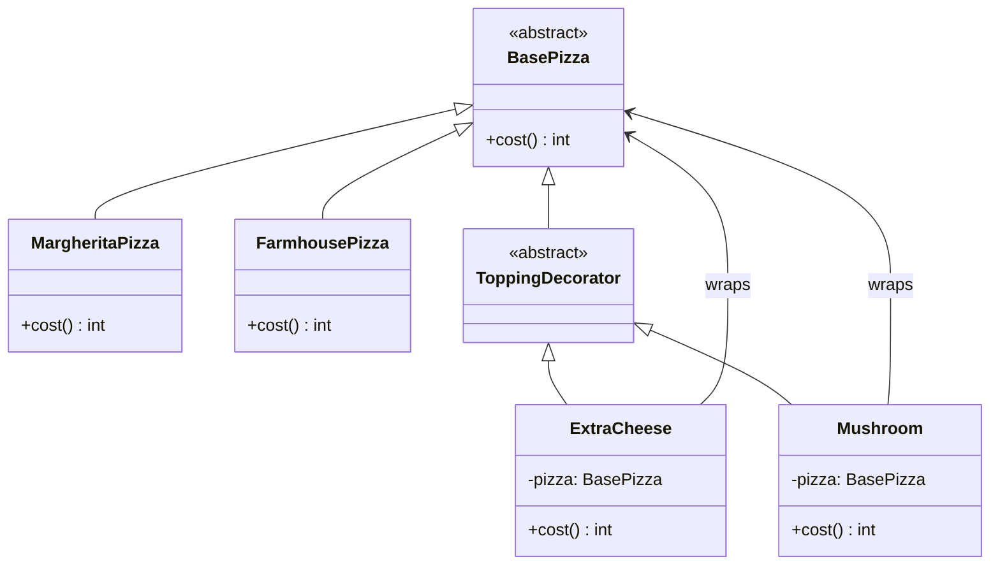

# Decorator Pattern

The **Decorator Pattern** is a structural design pattern that lets you attach new behaviors to objects by placing these objects inside special wrapper objects that contain the behaviors.

---

## 💡 Concept
Imagine you order a plain Margherita pizza. Now you want to add extra cheese, then mushrooms, then olives. Each topping adds to the cost and description of the pizza, but the base pizza remains unchanged. You are essentially "wrapping" the pizza with additional toppings.

The Decorator pattern works the same way — you wrap an object with decorator objects to add new responsibilities dynamically, without altering the original object's code. Each decorator adds its own behavior and then delegates to the wrapped object.

---

## ❓ Why Do We Need This Pattern?
1. **Dynamic Behavior**: Add or remove responsibilities from an object at runtime, without modifying its class.
2. **Avoids Class Explosion**: Instead of creating a subclass for every combination of features (e.g., `MargheritaWithCheeseAndMushroom`), you compose behaviors by stacking decorators.
3. **Open/Closed Principle**: Classes are open for extension but closed for modification — new functionality is added via new decorators, not by changing existing code.

---

## 🛠️ Key Components
1. **Component (Abstract Class / Interface)**: Defines the interface for objects that can have responsibilities added to them dynamically.
2. **Concrete Component**: The original object to which additional responsibilities can be attached.
3. **Decorator (Abstract)**: Maintains a reference to a Component object and conforms to the Component's interface. It acts as the base class for all concrete decorators.
4. **Concrete Decorator**: Adds responsibilities to the component by wrapping it and extending the decorator's behavior.

---

## 📝 Example Structure



### Simple Code Example

```java
// 1. Component (Abstract Class)
public abstract class BasePizza {
    abstract int cost();
}

// 2. Concrete Components
public class MargheritaPizza extends BasePizza {
    @Override
    public int cost() {
        return 200;
    }
}

public class FarmhousePizza extends BasePizza {
    @Override
    public int cost() {
        return 250;
    }
}

// 3. Decorator (Abstract)
public abstract class ToppingDecorator extends BasePizza {
    // Inherits cost() from BasePizza
}

// 4. Concrete Decorators
public class ExtraCheese extends ToppingDecorator {
    BasePizza pizza;

    public ExtraCheese(BasePizza pizza) {
        this.pizza = pizza;
    }

    int cost() {
        return pizza.cost() + 5;  // Adds its own cost on top
    }
}

public class Mushroom extends ToppingDecorator {
    BasePizza pizza;

    public Mushroom(BasePizza pizza) {
        this.pizza = pizza;
    }

    int cost() {
        return pizza.cost() + 15;  // Adds its own cost on top
    }
}

// 5. Client Usage
public class Main {
    public static void main(String[] args) {
        // Base pizza: ₹200
        BasePizza pizza = new MargheritaPizza();

        // Wrap with Extra Cheese: ₹200 + ₹5 = ₹205
        pizza = new ExtraCheese(pizza);

        // Wrap with Mushroom: ₹205 + ₹15 = ₹220
        pizza = new Mushroom(pizza);

        System.out.println("Total Cost: ₹" + pizza.cost());  // Output: ₹220
    }
}
```

### 🔑 How It Works (Step by Step)
1. Create a `MargheritaPizza` (cost = 200).
2. Wrap it with `ExtraCheese` — this decorator holds a reference to the pizza and adds ₹5 to its cost.
3. Wrap that with `Mushroom` — this decorator holds a reference to the cheese-wrapped pizza and adds ₹15.
4. When `cost()` is called, it cascades: `Mushroom.cost()` → `ExtraCheese.cost()` → `MargheritaPizza.cost()`, and the results are summed up the chain.

---

## ⚖️ Pros and Cons
### Pros:
- **Single Responsibility Principle**: You can divide a monolithic class that implements many possible variants of behavior into several smaller classes.
- **Runtime Flexibility**: You can add or remove responsibilities from an object at runtime by wrapping/unwrapping decorators.
- **Composable**: Decorators can be stacked in any order and combination, giving you immense flexibility.

### Cons:
- **Many Small Objects**: The design can result in many small objects that look similar, making the codebase harder to debug.
- **Order Dependency**: The behavior may depend on the order in which decorators are stacked, which can be tricky to manage.
- **Complex Unwrapping**: It's hard to remove a specific wrapper from a stack of decorators.
