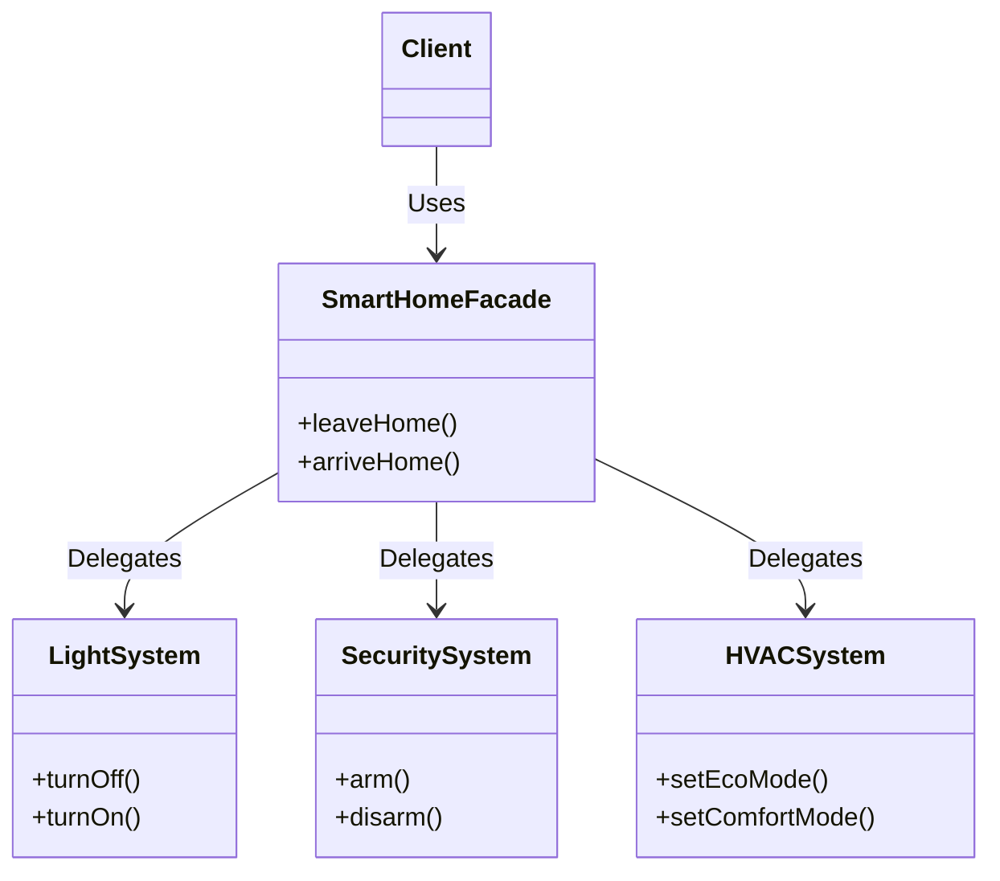

# Facade Pattern

The **Facade Pattern** is a structural design pattern that provides a simplified interface to a library, a framework, or any other complex set of classes.

---

## 💡 Concept
Imagine you want to watch a movie at home. This simple act might require you to turn on the TV, turn on the sound system, dim the lights, start the media player, and press play. That's a lot of steps involving many different systems.

A Facade is like a smart remote with a single "Watch Movie" button. It hides all the complex logic of interacting with multiple subsystems and gives you a single, easy-to-use interface.

---

## ❓ Why Do We Need This Pattern?
1. **Simplicity**: Hides the complexities of a larger system and provides a simple interface to the client.
2. **Decoupling**: Decouples the client from complex subsystem components, promoting subsystem independence and portability.
3. **Entry Point**: Provides a clear entry point into each level of a layered software architecture.

---

## 🛠️ Key Components
1. **Facade**: Knows which subsystem classes are responsible for a request. Delegates client requests to appropriate subsystem objects.
2. **Subsystems**: Implement subsystem functionality. Handle work assigned by the Facade object. They have no knowledge of the facade.
3. **Client**: Uses the Facade instead of calling the subsystem objects directly.

---

## 📝 Example Structure



### Simple Code Example

```java
// 1. Subsystems
class Amplifier {
    public void on() { System.out.println("Amplifier is on"); }
    public void setVolume(int level) { System.out.println("Setting volume to " + level); }
}

class Projector {
    public void on() { System.out.println("Projector is on"); }
    public void wideScreenMode() { System.out.println("Projector in widescreen mode"); }
}

class DvdPlayer {
    public void on() { System.out.println("DVD Player is on"); }
    public void play(String movie) { System.out.println("Playing movie: " + movie); }
}

// 2. Facade
public class HomeTheaterFacade {
    private Amplifier amp;
    private Projector projector;
    private DvdPlayer dvd;
    
    public HomeTheaterFacade(Amplifier amp, Projector projector, DvdPlayer dvd) {
        this.amp = amp;
        this.projector = projector;
        this.dvd = dvd;
    }
    
    public void watchMovie(String movie) {
        System.out.println("Get ready to watch a movie...");
        amp.on();
        amp.setVolume(5);
        projector.on();
        projector.wideScreenMode();
        dvd.on();
        dvd.play(movie);
    }
}

// 3. Client
public class Client {
    public static void main(String[] args) {
        Amplifier amp = new Amplifier();
        Projector projector = new Projector();
        DvdPlayer dvd = new DvdPlayer();
        
        HomeTheaterFacade homeTheater = new HomeTheaterFacade(amp, projector, dvd);
        
        // The client only interacts with the simple facade method
        homeTheater.watchMovie("Inception");
    }
}
```

---

## ⚖️ Pros and Cons
### Pros:
- **Isolation**: Isolates clients from the complexities of subsystems.
- **Loose Coupling**: Promotes weak coupling between the subsystem and its clients.

### Cons:
- **God Object Risk**: The facade can become a "God Object" coupled to all classes of an app if not designed carefully.
