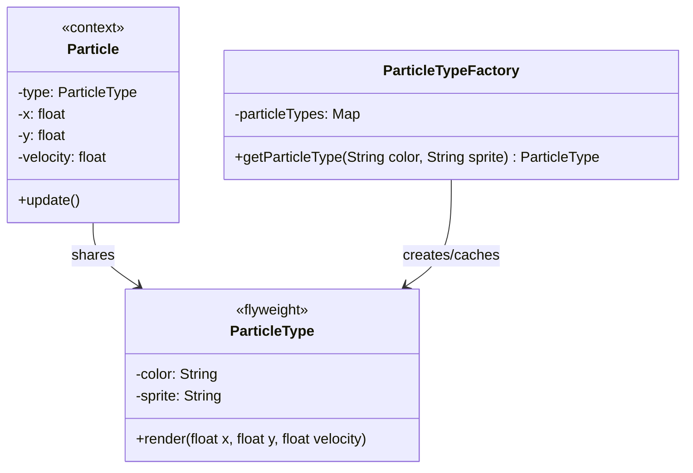

# Flyweight Pattern

The **Flyweight Pattern** is a structural design pattern that lets you fit more objects into the available amount of RAM by sharing common parts of state between multiple objects instead of keeping all of the data in each object.

---

## 💡 Concept
Imagine a video game with thousands of particles (bullets, explosions, shrapnel) on screen. Each particle has properties like color, sprite (image), position, velocity, etc. Storing all this data in every single particle would consume enormous amounts of memory.

The Flyweight pattern solves this by splitting the object's data into two parts:
- **Intrinsic state** (shared): Data that stays the same across many objects — like color and sprite. This is stored once in a shared **Flyweight** object.
- **Extrinsic state** (unique): Data that is unique to each object — like position and velocity. This is stored separately in each context object.

---

## ❓ Why Do We Need This Pattern?
1. **Memory Efficiency**: Dramatically reduces memory usage when dealing with a massive number of similar objects.
2. **Performance**: Fewer objects in memory means less garbage collection overhead and better cache performance.
3. **Scalability**: Allows your application to handle far more objects than it otherwise could.

---

## 🛠️ Key Components
1. **Flyweight**: The shared object that stores intrinsic (common) state. It should be immutable.
2. **Context**: The object that stores extrinsic (unique) state and holds a reference to a Flyweight.
3. **Flyweight Factory**: Creates and manages flyweight objects. It ensures that flyweights are shared — when a flyweight is requested, the factory either returns an existing one or creates a new one.
4. **Client**: Creates context objects and gets flyweights from the factory.

---

## 📝 Example Structure



### Simple Code Example

```java
// 1. Flyweight (Intrinsic State — shared and immutable)
public class ParticleType {
    private final String color;
    private final String sprite;

    public ParticleType(String color, String sprite) {
        this.color = color;
        this.sprite = sprite;
    }

    public void render(float x, float y, float velocity) {
        System.out.println("Rendering " + color + " particle at (" + x + "," + y +
                ") with sprite " + sprite);
    }
}

// 2. Context (Extrinsic State — unique per object)
public class Particle {
    private ParticleType type;  // reference to flyweight
    private float x;
    private float y;
    private float velocity;

    public Particle(ParticleType type, float x, float y, float velocity) {
        this.type = type;
        this.x = x;
        this.y = y;
        this.velocity = velocity;
    }

    public void update() {
        y += velocity;
        type.render(x, y, velocity);  // delegates to the shared flyweight
    }
}

// 3. Flyweight Factory (ensures sharing)
public class ParticleTypeFactory {
    private Map<String, ParticleType> particleTypes = new HashMap<>();

    public ParticleType getParticleType(String color, String sprite) {
        String key = color + "_" + sprite;
        return particleTypes.computeIfAbsent(key,
                k -> new ParticleType(color, sprite));
    }
}

// 4. Client Usage
public class Main {
    public static void main(String[] args) {
        ParticleTypeFactory factory = new ParticleTypeFactory();
        List<Particle> particles = new ArrayList<>();

        // All 1000 particles share ONE ParticleType object
        ParticleType explosionType = factory.getParticleType("red", "explosion.png");

        for (int i = 0; i < 1000; i++) {
            particles.add(new Particle(explosionType,
                    (float) Math.random() * 100,
                    (float) Math.random() * 100,
                    1.0f));
        }

        for (Particle particle : particles) {
            particle.update();
        }
    }
}
```

### 🔑 How It Works (Step by Step)
1. `ParticleType` stores the **intrinsic state** (color, sprite) — data shared across all particles of that type.
2. `Particle` stores the **extrinsic state** (x, y, velocity) — data unique to each particle.
3. `ParticleTypeFactory` uses a `HashMap` to cache `ParticleType` objects. If a type with the same color and sprite already exists, it returns the cached one instead of creating a new one.
4. Even though we create 1,000 `Particle` objects, only **one** `ParticleType` object is created in memory for `"red" + "explosion.png"`.

---

## ⚖️ Pros and Cons
### Pros:
- **Saves RAM**: You can save a lot of RAM when your program has many similar objects.
- **Centralized State**: Shared intrinsic state is stored in one place, making it easy to manage.

### Cons:
- **Code Complexity**: The code becomes more complicated as you have to split state into intrinsic and extrinsic parts.
- **CPU Trade-off**: You might be trading RAM for CPU cycles, since some context data might need to be recalculated each time a flyweight method is called.
