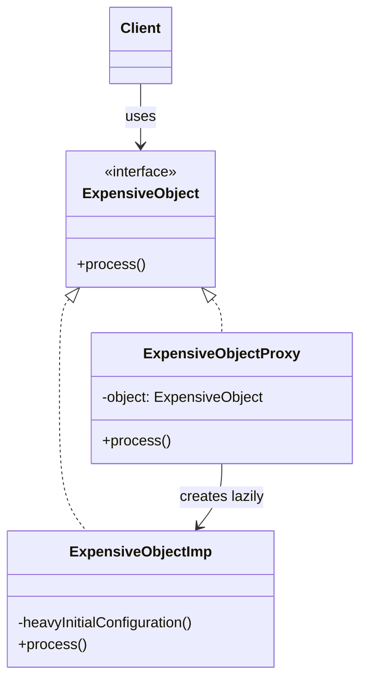

# Proxy Pattern

The **Proxy Pattern** is a structural design pattern that provides a substitute or placeholder for another object. A proxy controls access to the original object, allowing you to perform something either before or after the request gets through to the original object.

---

## 💡 Concept
Imagine you have a very heavy object — like a high-resolution image or a database connection — that is expensive to create. You don't want to create it until you actually need it. A Proxy acts like a stand-in: it looks and behaves like the real object, but it controls when and how the real object is created and accessed.

Think of a proxy like a credit card: it's a proxy for cash. Both implement the same interface (you can pay with either), but the credit card controls and adds logic around the actual payment.

---

## ❓ Why Do We Need This Pattern?
1. **Lazy Initialization (Virtual Proxy)**: Defer the creation of a heavy object until it is actually needed, instead of creating it upfront.
2. **Access Control (Protection Proxy)**: Control who can access the real object based on permissions or authentication.
3. **Logging / Caching**: Add extra behavior (like logging, caching, or rate-limiting) before delegating to the real object, without modifying the real object's code.

---

## 🛠️ Key Components
1. **Subject (Interface)**: Declares the common interface for the Real Subject and Proxy, so the Proxy can be used anywhere the Real Subject is expected.
2. **Real Subject**: The actual object that does the heavy work. It contains the core business logic.
3. **Proxy**: Holds a reference to the Real Subject and controls access to it. It implements the same interface.
4. **Client**: Works with the Subject interface, unaware of whether it's using a Proxy or the Real Subject.

---

## 📝 Example Structure



### Simple Code Example

```java
// 1. Subject Interface
public interface ExpensiveObject {
    void process();
}

// 2. Real Subject (expensive to create)
public class ExpensiveObjectImp implements ExpensiveObject {

    public ExpensiveObjectImp() {
        heavyInitialConfiguration();  // Runs on creation — slow!
    }

    @Override
    public void process() {
        System.out.println("processing complete.");
    }

    private void heavyInitialConfiguration() {
        System.out.println("Loading initial configuration...");
    }
}

// 3. Proxy (controls access, adds lazy initialization)
public class ExpensiveObjectProxy implements ExpensiveObject {
    private static ExpensiveObject object;

    @Override
    public void process() {
        if (object == null) {
            object = new ExpensiveObjectImp();  // Created only when first needed
        }
        object.process();  // Delegates to the real object
    }
}

// 4. Client Usage
public class Main {
    public static void main(String[] args) {
        ExpensiveObject object = new ExpensiveObjectProxy();
        // The real object is NOT created yet at this point

        object.process();  // Now the real object is created and process() runs
        object.process();  // Uses the already-created real object
    }
}
```

### 🔑 How It Works (Step by Step)
1. The client creates an `ExpensiveObjectProxy` — this is lightweight and instant.
2. The real `ExpensiveObjectImp` is **not** created yet (no heavy configuration runs).
3. When `process()` is called for the first time, the proxy checks if the real object exists. It doesn't, so it creates it (triggering the slow configuration).
4. On subsequent calls to `process()`, the proxy simply delegates to the already-created real object — no re-initialization.

---

## ⚖️ Pros and Cons
### Pros:
- **Lazy Loading**: The heavy object is only created when it's truly needed, saving startup time and memory.
- **Transparent**: The client doesn't know whether it's working with a proxy or the real object, since both implement the same interface.
- **Open/Closed Principle**: You can introduce new proxies without changing the real subject or the client.

### Cons:
- **Response Delay**: The first request might be slower because the proxy has to initialize the real object.
- **Code Complexity**: Introduces an extra layer of abstraction, which can make the code harder to follow.
